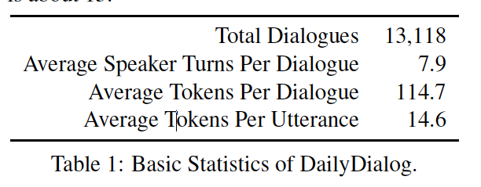
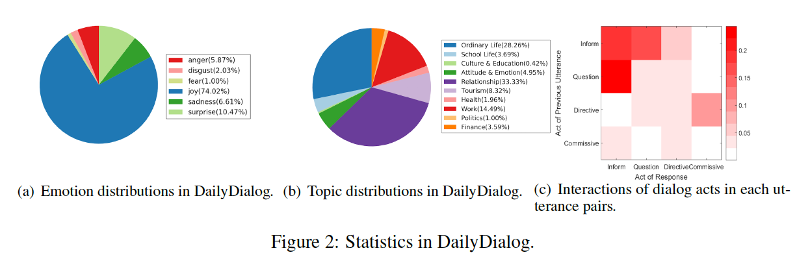
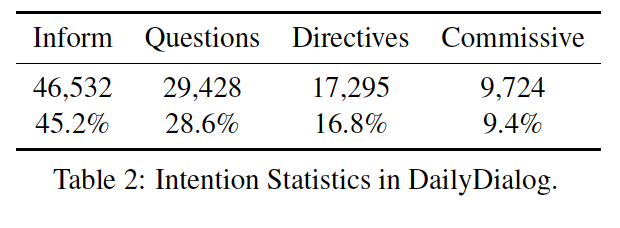
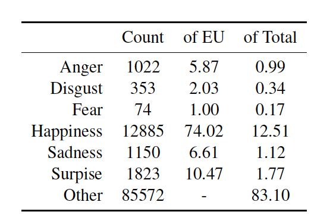
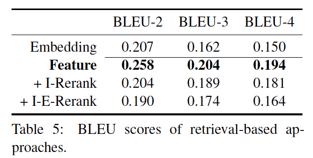
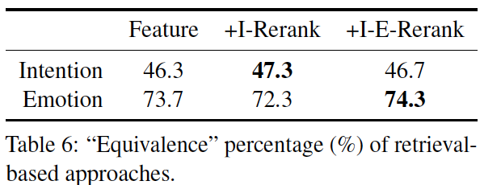
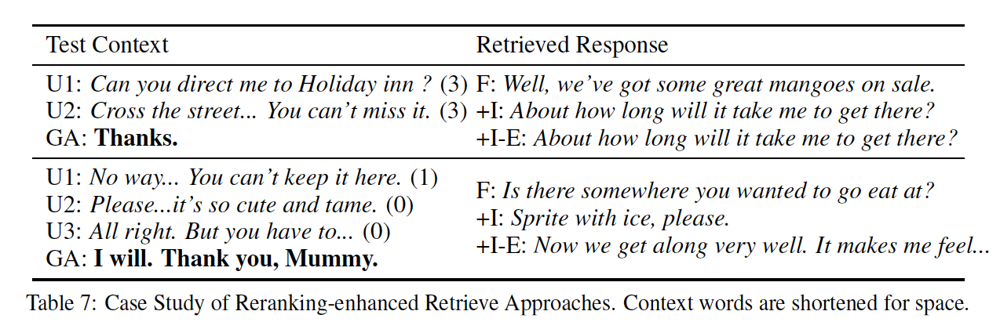
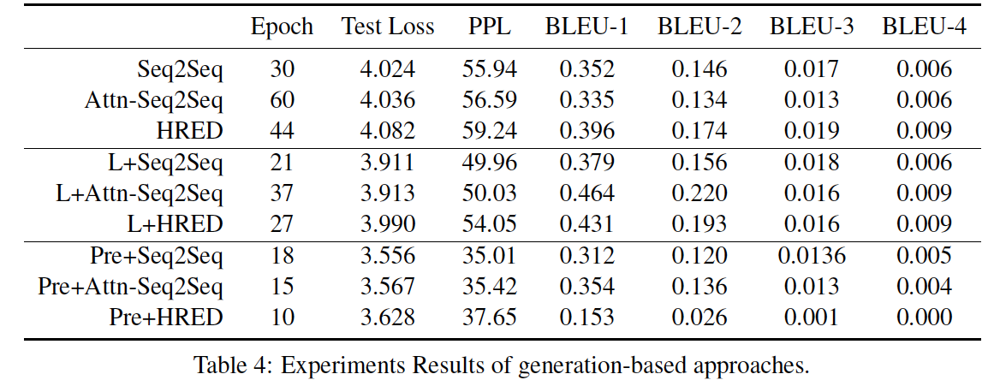

## 一.Motivation:

现实社会中，人类之间的沟通交流对话主要有两个目的：**交换信息**和**建立社交联系**；

如果是为了交换分享想法，一般情况下，我们不会仅仅等待回答他人的提问，也会主动引起改变话题或者发问，使得对话可以交流下去；

如果是为了建立社交联系，我们的对话应该丰富多彩并且包含情感。

而现有数据集中不符合这种情况。

我们通过如图1中的示例对话来证明上述两种现象。斜体单词表示说话者B自己的想法，对于另一个说话者A是崭新的。带有下划线的单词用紫色明确表示情绪。 在第四个发言者中，发言者B首先表达了他/她对发言者A听到的内容的感受，这表明了他/她的理解。 然后，演讲者B建议说，当你感到心烦意乱时，请深呼吸。 在对A的直接回应之后，B的建议是首次出现的，而且依赖于上下文。 它表明B通过响应上述上下文并提出新建议来建立连接。

## 三.数据集构建过程

### 2.1.基本特征和数据统计

本数据集的采集来自于英语学习者相关的网站，作者爬取了大量英语学习网站中的对话练习内容。关于选择英语学习者相关网站作为对话数据采集源的原因，作者主要做出以下三点阐释：

1、这些网站上的对话是英语学习者书写的，相比较于Twitter Dialog Corpus (Ritter et al., 2011)和Chinese Weibo dataset (Wang et al., 2013)这些由微博构造的数据集在语法上更规范严谨。

2、这些网站上的对话通常更集中关注于几大主题，对话主题更集中，对训练对话模型更有帮助，而微博类型的数据集通常是取微博和评论来构造，主题不集中。

当然在英语学习者相关的网站上爬取的对话数据集也是有一些缺陷的，比如英语拼写错误等问题。不过作者在这里采用了一个开源的英文[自动纠错程序](https://link.zhihu.com/?target=https%3A//github.com/phatpiglet/autocorrect/)来消除了简单的英语单词拼写错误问题。并且去除了谈论人数大于2个人 的数据。

数据集爬取效果：总共有13000对个对话，每个对话大概有8轮，每次发言的句子平均有14.6个单词。

### 2.2.数据集设计

数据爬取下来以后最重要的工作就是做标记，这是一个繁重枯燥而又极其具有价值的工作，作者为每句话标注了intention和emotion。在intention上作者遵循了 Amanova et al. (2016) 的方法，它是基于国际主流标准ISO 24617-2制定的。这篇论文将intention分为**{Inform,Questions,Directives, Commissive}**四个方面。前两类是信息传递行为，而后两类是行动讨论行为。 详细解释可以在Amanova等人的文章中找到。

- Inform指通知类意图,Inform类包含发言者提供信息的所有陈述句和问句;

- Questions指疑问类意图，当发言者想要询问某些信息时就会被标注Questions;

- Directives指建议类的意图，如请求，指示，建议和接受/拒绝邀请;

- Commissive指接受，拒绝之类的意图。Commissive类是关于接受/拒绝请求或建议和邀约。

在emotion上作者遵循(Wang et al., 2013)的方法，在该方法中将情绪分为了7类: **{Anger, Disgust, Fear, Happiness,Sadness, Surprise}**，作者在此基础上增加了**other**类。

在标注上，该数据集由3名专家标注，为了得到统一的标注效果，作者首先经过100句的标注作为示例，再由3名专家各自独立标注，最后对标注中有歧义的部分讨论标注。

## 三.DailyDialog数据集优点：

1.语言是人类编写的，缺少噪音；

2.涵盖了10大类日常主题话题，与domain-specific数据集不同；

3.反应了我们日常交流的方式，它符合基本对话行为流程，例如Question - Inform和Diredtives - Commissives -双向流动，使其与问答（QA）数据集和Post-reply数据集不同。

4.确定的对话模式，它遵循独特的多转对话流模式，反映人类的沟通风格，这在面向任务的数据集中很少见。

5.包含丰富的情感信息，使用人工标注了数据集中的情感和意图；

### 3.1.数据集的主题

该数据集中的对话发生在我们的日常生活中，这就是将其命名为DailyDialog的原因。 涵盖了广泛的日常场景：关于假期和旅游的闲聊，商店和餐馆的服务对话等等。 在研究了它们的主题后，作者将它们分为十个类别。 每个类别的统计数据总结在图2（b）中。

最大的三个类别是：人际关系（八卦）（33.33％），普通生活（28.26％）和工作（14.49％）。 这也符合我们的实际经验，我们经常邀请人们参与社交活动（关系），谈论最近发生的事情（普通生活）和工作中发生的事情（工作）。

### 3.3.双向数据流

因为假设对话在日常生活中发生，所以它们遵循自然对话流程。 它使DailyDialog数据集与现有的QA数据集完全不同，例如SubTle数据集（Dodge等，2015），它们不适合用于训练对话系统。 DailyDialog数据集还区别于诸如Reddit评论（Al-Rfou'等人，2016），新浪微博（Shang等人，2015）和Twitter（Ritter等人，2011）数据集之类的回复数据集。 后面的数据集包括社交网络上的post-reply对，人们可以更自由地与他人交互（通常超过两个发言者）并导致模糊的对话流。

DailyDialog数据集与我们日常生活一致，例如：

- Questions-Inform bi-turn dialog flow.对于别人的提问，我们不会简单的转变话题，而是一般礼貌的回答
- Directives-Commissives dialog flow：如果别人发出提问我们一般需要接受或者拒绝

### 3.4.确定的交流模式

除了基本的Questions-Inform和Directives-Commissives双向对话流之外，我们还在DailyDialog数据集中找到两个独特的多转流模式。

- 模式一：在人与人之间的交流中，人们倾向于回答问题，然后提出新问题以使对话持续。 换句话说，发言者可以在单个对话中从信息提供者变为信息寻求者。 我们发现DailyDialog中的2,398（18.3％）个对话展示了这种模式，这种情况非常频繁。

- 模式2：当某人提议某项活动或提出建议时，另一位发言者通常会提出另一个想法。 这是有意义的，因为两位发言者通常对某个主题有不同的看法，通过交换不同的提议，他们说服并影响另一方。 这导致对话流中的Directives-Directives-Commissives-like模式，在我们的数据集中总共发生了1,203次（9.2％）。

  这两种模式阐明了我们的日常沟通方式，这些模式仅存在于单圈数据集或面向任务的数据集中， 如Ubuntu（Lowe等，2015）和餐馆预订数据集（Bordes和Weston，2016）。

###3.5.丰富的情感

日常沟通的另一个主要目的是加强社会联系。 因此，人们倾向于在交流中表达自己的情感。  由于自动情绪分类很困难（Zhou et al。，2017），我们手动标记每个话语的情绪，使其尽可能准确。 这将DailyDialog数据集与大多数现有对话框数据集区分开来。 同样，我们总结了表3.3中标记情绪的基本统计数据。

此外，我们在日常生活中观察到，健康愉快的谈话往往以积极情绪结束。 因此，我们检查我们的DailyDialog数据集是通过多少对话结束或正面情绪（即快乐），并找到3,675（28.0％）“快乐”对话。 我们还计算了有多少对话已经改变为积极情绪，即使他们以负面情绪（例如悲伤，厌恶，愤怒）开始，并找到113（0.8％）这样的例子。 我们希望我们的数据集能够促进未来的研究，以开发能够将谈话调节到愉快结局的对话机器人。

DailyDialog中的情感统计。 EU表示包含主要六个的情感类别的话语，而Total表示数据集中的所有话语。 数字乘以100％。

## 四. 评估已有方法

现有的主流回复检索方法主要有以下几类：

- Embedding-based Similarity for Response Retrieval
- Feature-based Similarity for Response Retrieval
- Feature-based Similarity for Response Retrieval and Reranking
- Neural network-based for Response Generation
- Neural network-based for Response Generation with Labeling Information

### 4.1.实验设置

随机将DailyDialog数据集分成训练/验证/测试集，分别包含11,118 / 1,000 / 1,000轮对话。

 调整验证集上的参数并报告测试集上的性能。 在所有实验中，词汇量大小设置为25,000，并且所有OOV词都映射到UNK。 word embedding维度设置为300，并使用在Google新闻语料库4上训练的Word2Vec嵌入来初始化它们。 以下实验中的编码器和解码器RNN是具有512个隐藏神经元的1层GRU（Cho等人，2014）。
然后将所有训练的模型参数用作初始化点。 我们将batch_size设置为128并将学习率固定为0.0002。 使用Adam优化器训练模型以最小化交叉熵（Kingma和Ba，2014）。

###4.2.基于检索的方法

共选择了三类四种基于检索的方法，即（1）基于embedding的相似性（Luo和Li，2016）; （2）基于feature的相似性（Jafarpour等，2010; Yan等，2016）; （3）（4）基于特征的相似性与意图和情感重排序（Luo和Li，2016; Otsuka等，2017）。 我们的目标是在DailyDialog上查看基于经典embedding，基于特征和重排序增强的方法是否有效。

####4.2.1.Embedding-based Similarity for Response Retrieval

基于embedding的回复检索方法，首先要训练[词向量（Word embedding）](https://www.zhihu.com/question/32275069)。作者在Google News Corpus数据集上利用Word2Vec工具训练出word embedding,对两个词的相似度计算利用了向量之间的cosine值，得到的值越高排名越高。

####4.2.2.Feature-based Similarity for Response Retrieval

基于特征的方法主要应用文本语言特征，利用[TF-IDF](https://link.zhihu.com/?target=https%3A//baike.baidu.com/item/tf-idf/8816134%3Ffr%3Daladdin)和几个模糊特征QRatio, WRatio和Partial ratio来对回复进行排名。首先先利用TF-IDF筛选出1000个候选答案，然后利用以上几个模糊特征对候选答案进行排名。

####4.2.3.Feature-based Similarity for Response Retrieval and Reranking

这个方法也是基于特征的，不过做重要的是他对基于特征的方法进行了重排，先利用基于特征的方法选出一些答案，然后取排名靠前的几个，利用一些特殊的特征进行Reranking

Reranking方法：

- 基于intention的方法{+ I-Rerank}：intention就是dialog act，前面在对数据集标注上提到过，主要分为四类{Inform, Questions,Directives, Commissive}，我们通过比较对话者历史对话记录的intention来对基于特征的方法的结果进行重排。比如我们对话者历史意图为{2,1,3}而候选回复接近对话者的意图的将会得到更高的排名。

- 基于intention加emotion的方法{+I-E-Rerank}:emotion有8类{Anger, Disgust, Fear, Happiness,Sadness, Surprise}，一个合适的回复必须要考虑到emotion，根据对话者情感状态选择合适的emotion的回复将会使回复质量得到大大的提升。

  

  由于测试集中的groundtruth响应未在训练集中看到，因此我们无法使用Recall-k等类似排名的指标来评估性能。 我们报告了表5中基于检索的方法实现的BLEU分数。

  

  我们还通过计算检索到的响应的标签（即意图，情感）与地面回复的标签之间的“equivalence””百分比来评估它们。 结果报告在表6中。虽然使用标签时可以看到细微的改进，但我们推测它不是一个非常强大的评估指标。 得出结论：“equivalence””百分比越高，检索到的响应越好（越连贯，越适合），这是不安全的。

  ####4.2.4.检索方法结果比较

  在对话响应生成中，诸如BLEU的单词级重叠度量方法是不充分的（Liu et al。，2016）。 为了提供关于意图和情感是否有益以及它们如何有效的见解，我们在表7中进行了几个案例研究。

  

  在第一个块中，我们举例说明意图如何帮助找到更合适的响应。 Test Context（U1和U2）中的意图是{3,3}，意思是{Directives, Directives}。 测试集中的原文回答（GA）是“谢谢”。虽然三个检索到的答案与GA都不完全相同，但是通过意图（+ I）重新排名和通过意图和情感（+ IE）重新排名的方法更适合回复而不是基于特征的方法而不重新排名（F）。 这是因为，与检索到的回答相对应的上下文“About how long will it take me to get there?” 是“Excuse me, but can you tell me the way... Just gostraight... You can t miss it”,，其对话行为流程{3,3}与上下文测试一致。 相反，基于特征的方法所发现的反应具有“你能指导我出售一些新鲜农产品吗？”的背景，这应该归于糟糕的结果。

  第二个区块中给出了类似的情况显示情绪历史信息有益的。  Test Context（U1，U2和U3）中的情绪是{1,0,0}，意思是{Anger，Others，Others}。 最正确的检索回答来自意图和情绪的重新排名方法（+ I-E），发现““Now we get along very well. It makes me feel that I’m someone special. It makes me feel that I’m

  someone special.”。“这个回应的背景历史是”哦，真的吗？ 所以你刚把一只流浪猫带回家？ //对 当我看到它时，它正在挨饿并寻找吃的东西。 //可怜的猫。“他的情感历史是{6,0,0}。

### 4.3.基于生成的方法

#### 4.3.1.Seq2Seq

最简单的基于生成的方法是以GRU作为基本单元的Seq2Seq，如4.1节所述。 这种方法被广泛选择作为对话生成的基线模型。

#### 4.3.2.Attention-based Seq2Seq

评估结合注意力机制的Seq2Seq方法（Bahdanau等，2014），该方法已显示其对各种NLP任务的有效性，包括对话响应（Hermann等，2015; Luong等，2015; Mei等，2017））。 我们将此方法表示为{Attn-Seq2Seq}。

#### 4.3.3.HRED（hierarchical encoder-decoder）

由于其上下文软件建模能力，HRED在以前的工作中表现出了更好的表现。

#### 4.3.4.Intention and Emotion-enhanced

为了利用意图和情感标签，遵循周等人。 （2017）在解码期间利用标签信息。 Intention和emotion标签被描述为一个one-hot 向量。 我们将标签增强方法表示为{L +}，并且在表4的第二个框中给出了性能。

#### 4.3.5.Pretrained

研究了与其他数据集的预训练是否会提高前三代方法的性能。 使用OpenSubtitle数据集（J¨orgTiedemann，2009，因为它没有针对每个会话的清晰和简洁的分段，我们将三个连续的话语中的每一个视为上下文，并将前一个作为响应。 最后，随机抽取3,000,000个三轮对话，并用于预先训练12个时期的比较模型。 我们将使用预训练的方法表示为{Pre +}。

####4.4.6.生成方法结果比较

在三种生成式方法中，HRED实现了最高的BLEU分数，因为它考虑了历史信息。此外，即使我们以最简单的方式利用它们，标签信息也是有效的。 这些发现与以前的工作一致。

另一方面，表4中的前三列显示OpenSubtitle预训练的模型收敛速度更快，实现更低的困惑度（PPL），但BLEU得分更差。 我们猜测它是domain 差异的结果。 OpenSubtitle数据集由电影线构成，而我们的数据集是每日对话。 此外，OpenSubtitles在一次对话中有大约1000多个发言者回合，而我们的数据集平均有8个回合。 通过来自不同域的语料库预先训练模型将损害其在目标域上的性能。 因此，简单地预先训练具有大规模数据集的模型（例如OpenSubtitle，其与评估数据集不同的域）是不太理想的。 我们进一步研究了这个问题，通过仅在DailyDialog上训练的模型比较生成的答案，无论是否有预训练。

### 4.4.实例学习

我们在表8中给出了一个案例研究。可以看出两个预先训练的模型（第二行和第四行）产生与上下文无关的响应。 相反，没有预训练的相应模型产生更合理的响应。

## 5.相关工作

###5.1.Domain-Specific Datasets：

- TRAINS (Ringger et al., 1996) ：主要包含在购物领域的问题和解决方法的对话，通常用语训练task-oranted对话系统。
- bAbI synthetic dialog (Bordes and Weston, 2016) and Movie Dialog datasets (Dodge
  et al., 2015)：主要是餐厅点餐和电影订票方面的对话数据
- Ubuntu dataset (Lowe et al., 2015)：这个数据库主要是由ubuntu系统的维护者和使用者在网站上的疑难问题的对话日志组成

###5.2.Open-Domain Datasets：

- Sina Weibo dataset (Wang et al., 2013)&Twitter dataset：爬取大量的微博和下面的回复作为对话
- OpenSubtitle (Jorg Tiedemann ¨ , 2009) &SubTle dataset (Bordes and Weston,
  2016)：由大量电影的字幕构造的对话集（每3句做一个分割，第3句作为回复）

Open-Domain Datasets大而杂，因为Open-Domain的对话系统通常是闲聊机器人，现在流行的训练方法是基于神经网络的seq2seq encoder-decoder的模型来训练的，因此需要大量的语料，而这种语料很难得，微博和电影字幕构造的语料库虽然大但不算是正真的对话，对模型的效果影响也非常大。作者推出了DailyDialog数据集有比较优异的性能，相信对模型的改善有所裨益。

## 6.未来工作

开发了高质量，多轮，采用手工标记的对话数据集DailyDialog， 在四个主要方面具有吸引力。 数据集中的对话共有十个主题，并且符合常见的对话流程。 此外，DailyDialog包含独特的多圈对话流模式，这反映了我们真实的沟通方式。 它富有情感。 第4节中的评估结果是简单但是指示性的。 

数据集地址：http://yanran.li/dailydialog

