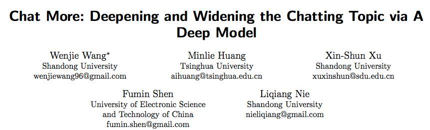

**摘要:**
过去十年来，人机交互方法经历了蓬勃的发展，尤其是通过对话系统的交互。在本论文中，我们研究了开放域多轮对话系统的答复生成任务。值得一提的是，虽然已经有很多致力于研究对话系统的工作，但其中很少涉及加深或拓宽对话中的聊天话题，而这有助于增加用户与机器聊天的时间。为了吸引用户与对话系统交流，我们在本论文中提出了一种全新的深度模型，其包含 3 个通道，即**全局通道、深度通道和宽度通道**。

- 全局通道是编码给定上下文语境中的完整历史信息;

- 宽度通道使用了基于注意力机制的循环神经网络来预测可能没有出现在历史语境中的、与话题相关的关键词;

- 深度通道是训练一个多层感知机模型来从上下文关键词中选择一些进行话题的深入。

  之后，我们的模型将这三个通道的输出整合起来生成所需的答复。为了验证我们的模型，我们进行了大量实验，在两个数据集上将我们的模型与几种当前最佳的基准模型进行了比较；其中一个数据集是我们自己构建的，另一个公开的基准数据集。实验结果表明，我们的模型通过拓宽或加深相关话题大大提高了生成回复的质量。

论文、数据和代码地址：https://sigirdawnet.wixsite.com/dawnet

## 一.介绍

对话系统也被称为聊天机器人或会话智能体，有很多广泛地应用，范围涵盖娱乐、知识共享和客户服务等。粗略而言，对话系统可分为任务导向型的对话系统和非面向任务的对话系统。前者可用于完成垂直领域内的特定任务；而后者的目标则是与人进行开放领域的闲聊。从技术上讲，这两类对话系统可以通过基于规则的方法、基于检索的方法或基于生成的方法实现。更具体地，由基于规则的方法定义的启发式模板在一定程度上会限制所希望得到的对话系统的多样性。基于检索的方法则往往严重依赖于其所检索的数据库。相对而言，基于生成的方法可以生成更灵活的答复——这种方法通常是将问题-回复对（post-response pair）分别当作输入和输出来训练一个深度神经网络。

在对话过程中，历史会话对接下来的聊天而言非常重要；而单轮对话式的基于生成的模型会忽略上下文语境。为了缓解这个问题，研究者们设计了一些多轮对话系统，其中采用了多种方式来将上下文信息表示成一个密集且连续的向量。比如，层次化的编码器-解码器模型（HRED）[1] 是分层式地编码上下文，其中历史对话被建模成了一个句子级别的序列且每个句子都被建模成一个词序列。我们必须指出，近些年来，研究者们已经为多轮对话系统提出了多种不同的利用上下文信息的方法，并且也取得了很大的成功。

但是，由于以下问题，这些方法的表现仍然有一些局限：1）根据我们对超过 1000 轮对话的用户调查，上下文语境中仅有 45.2% 的短语有助于直接引导回复生成。尽管如此，之前很多研究都考虑了整个上下文中的所有短语，而没有做进一步的区分，这实际上会影响模型的表现。2）我们的研究表明，在会话中，人们往往会加深或拓宽他们正在讨论的话题，让对话内容更加宽泛有趣，如表 1 所示；但是到目前为止，注意到这一现象的研究者还很少。3）当前的基于生成的对话系统往往会生成枯燥乏味的答复，这些答复是通用型的、信息更少且没多大意义。比如，生成的回复「我不知道」。有鉴于此，我们就非常需要一种新的智能对话系统，其要能利用相关的语境信息来引导聊天会话向更深度和更宽泛的方向发展。

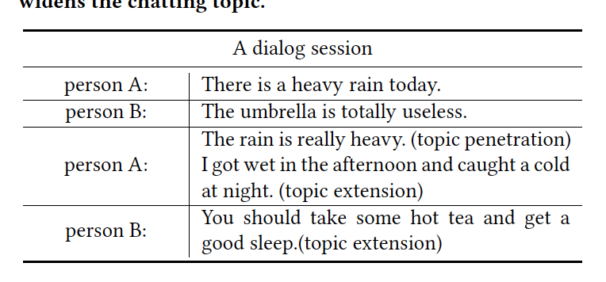

*表 1：加深和拓宽聊天话题的多轮对话示例*

但是，解决多轮对话系统中上述问题的有很大的难度，原因如下：1）长的上下文语境中的相关短语可能会被埋没在不相关短语中，这会增加问题的难度，如何识别相关信息以有效地引导回复生成是一个悬而未决的问题。2）生成枯燥沉闷的答复或者一直谈论同一个话题是很无趣的，通常会让人很快结束与机器的对话。因此，我们如何避免沉闷无趣的答复并且确保所生成的答复不仅是相关的而且能够加深和拓宽当前话题是我们面临的又一个难题。3）为了确保基于生成的模型的稳健性，一个大规模数据集是很关键的。然而，目前发布的多轮对话数据集要么是垂直领域的，要么规模比较小。

为了解决上述问题，我们提出了一个深度网络模型 DAWnet，如图 1 所示。该网络由 3 个并行通道构成，分别为全局通道、深度通道和宽度通道。DAWnet 的目标是加深和拓宽聊天话题来提高回复的质量。更具体而言，全局通道首先会将给定上下文 (context) 转换成一个嵌入向量，其中编码了完整的历史信息。然后 DAWnet 会从句子中抽取出关键词，在收集到的关键词和上下文嵌入向量的基础上，宽度通道依赖一个基于注意力机制的循环神经网络（RNN）模型来预测相关话题的关键词。值得注意的是，这些关键词可能并没有出现在给定上下文中。深度通道则是通过训练一个多层感知机（MLP）模型来从上下文选择一些关键词进行话题的深入，其输入是上下文嵌入向量和收集到的关键词。我们的整个方案最后会将上下文编码器的输出、宽度通道中预测的关键词、深度通道中选择的关键词输入一个基于注意力机制的选择器，帮助解码器生成有意义的答复。

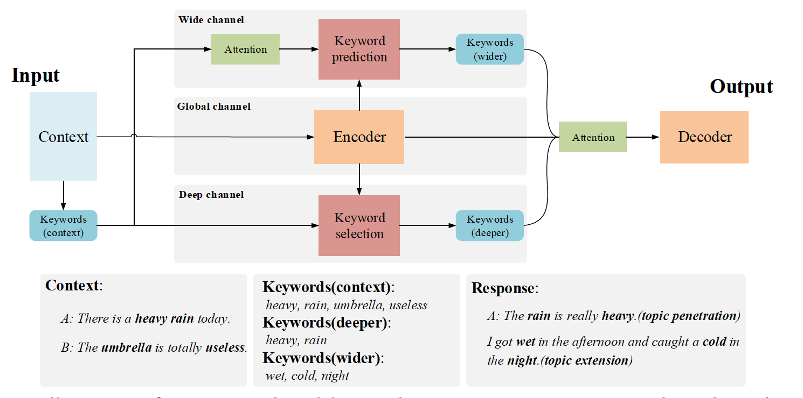

*图 1：DAWnet 模型的示意图*

为了训练 DAWnet 和评估其在答复的连贯性、信息量和多样性方面的表现，我们构建了一个开放域的多轮对话数据集，即新浪微博对话语料库（Sina Weibo Conversation Corpus），它涵盖了我们日常对话的多数话题。为了证明 DAWnet 的效果，我们还在一个基准数据集 DailyDialog[2] 上测试了 DAWnet。我们在这两个数据集上将 DAWnet 与其它几种当前最佳的方法进行了比较。实验结果表明 DAWnet 能在多轮对话系统中实现了有潜力的表现。

我们的研究主要有三大贡献：

- DAWnet 提取出上下文中的关键词信息，并且利用注意力机制选择相关的关键词来帮助生成有意义的答复。
- 就我们所知，这是第一个在多轮对话系统中通过混合 RNN 和 DNN 模型来加深和拓宽聊天话题，以激励用户更多地和机器交谈的研究。
- 我们构建了一个开放域的多轮对话数据集。此外，我们还发布了这些数据、代码和相关参数，以便该领域的其他研究者使用。

## 二.相关工作

### 2.1.研究背景

```
对话系统:
    1) task-oriented: vertical domains
    2) non-task-oriented: open-domain topics

Implement methods:
    1) Rule-based: restrict diversity
      依赖于手工构建的模板和规则，阻碍了对其他领域的泛化能力
    2) Retrieval-based: depend repository
    3) Generation-based: more flexible
        a) Single-turn: neglect historical conversation
        b) Multi-turn
```

------

需要把相关文献读一下！！！！ToDo

2）基于检索的方法：通常通过用各种匹配算法对response候选进行排序来选择合适的response

  **缺点**：

- 虽然基于检索的模型可以从数据中检索信息丰富和充满多样化的响应，但它们必须满足这一前提条件：所选的response应该预先存在。因此，性能受到存储库的规模和质量的限制。

- 单轮检索模型论文：

  A Dataset for Research on Short-Text Conversations.

  Syntax-Based Deep Matching of Short Texts

 - 多轮检索模型论文：

  Sequential Matching Network: A New Architecture for Multi-turn Response Selection in Retrieval-Based Chatbots. （吴yu）

  Learning to Respond with Deep Neural Networks for Retrieval-Based Human-Computer Conversation System.（严睿）

  Joint Learning of Response Ranking and Next Utterance Suggestion in Human-Computer Conversation

  System.（严睿）

3）基于生成的方法  ——**http://www.infosec-wiki.com/?p=40208**

[A Neural Network Approach to Context-Sensitive Generation of Conversational Responses](https://michaelauli.github.io/papers/chitchat.pdf)对上下文进行编码并发布到固定长度的向量中，并将它们输入回归神经网络语言模型以生成响应。

[A Hierarchical Latent Variable Encoder-Decoder Model for Generating Dialogues](http://www.shuang0420.com/2017/11/17/%E8%AE%BA%E6%96%87%E7%AC%94%E8%AE%B0%20-%20HRED%20%E4%B8%8E%20VHRED/)HRED 和VHRED

**Multiresolution Recurrent Neural Networks: An Application to Dialogue Response Generation**通过对序列上的联合概率进行因式分解来建模多个平行序列。交互式对话上下文语言模型通过使用两个并行的RNN来跟踪对话中的说话者之间的交互

**Deep Reinforcement Learning for Dialogue Generation**通过整合神经SEQ2SEQ系统[2]和深度强化学习的优势来模拟两个代理之间的对话

 **Coherent Dialogue with Attention-based Language Models**提出了基于RNN的对话模型，该模型配备了动态注意机制，以增加对会话历史的关注范围。

**缺点**

由于一般词的高频率，生成式模型倾向于产生枯燥的响应。为了提高response的质量，已经提出了各种方法。

**Attention with Intention for a Neural Network Conversation Model** 添加了一个RNN来模拟SEQ2SEQ模型中意图过程的动态。

**A Diversity-Promoting Objective Function for Neural Conversation Models.** 使用最大互信息作为神经模型中的目标函数来减轻迟钝的反应

**Topic Aware Neural Response Generation.** 主题感知序列到序列模型考虑主题词来自Twitter LDA模型的响应生成中的主题词。但是，使用Twitter LDA获取此类主题词具有挑战性，因为帖子非常短，开放域对话中的主题很少。根据我们对新浪微博对话语料库300万次会议的统计数据，有超过2500万个独特单词，其中超过一半出现不到五次。考虑到稀疏性问题，很难根据短篇帖子确定相关主题词。

-------


本文的**创新点**：

- 研究了上下文感知对话系统，因为对话是连续的，因此生成回复必须考虑对话的历史。
- 更深更广的拓宽聊天主题，使得聊天进行的更顺利。

## 三.模型

为了深化和拓宽聊天主题，我们提出了一个方案来探索对话框中的关键字，如图1所示。该方案首先对话语进行分段并从上下文中提取关键字。 之后，模型将上下文及其关键字输入三个并行通道，即全局，宽和深通道。

>用TF-IDF从之前对话中选出几个关键词。把之前对话context揉成一整句，用GRU学一个表示。然后用一个attention模型读入context词表示和TF-IDF选出的关键词，然后decode出几个不在context里面的词作为对话扩展词。然后用一个self Attention给TF_IDF给出的关键词权重。将GRU的表示，扩展的关键词，和加权的ctx关键词一起送到decoder里面进行decode，得到最终结果.

 最终，该模型采用注意机制来对上下文和关键字进行权衡，然后将它们馈送到用于生成响应的RNN解码器中。 在本节中，我们将详细介绍该方案的每个组成部分。


### 3.1.抽取关键词


>TF-IDF：
>a）保留名词，动词和形容词，删除其他词语
>b）a session as a document
>c）a word as a term
>
>d) 从每个session中选择前20个词

### 3.2.Global Channel

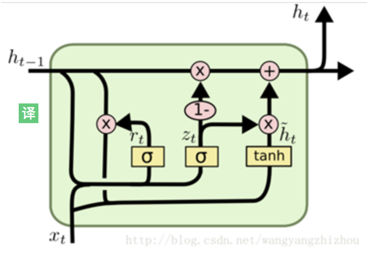

>通过一个GRU网络编码对话历史
>
>the context C denotes a sequence of T tokens

### 3.3.Wide Channel

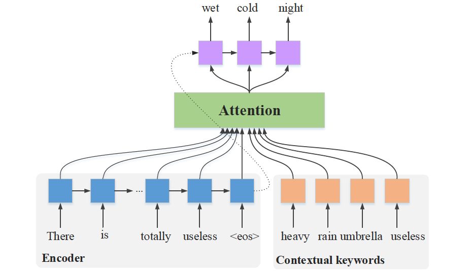

*图 2：用于话题拓展的关键词预测。其中关键词解码器由编码器的最后一个隐藏状态初始化，并基于该编码器的隐藏状态和上下文关键词来生成关键词。*
$$
公式（1）：s_t = f(s_{t-1},[e_{k^p_{t-1}},c_t])
$$
$e_{t-1}^p$表示关键词序列中，$t-1$时刻的关键词的嵌入向量；对于$t_1$来说，$e_{t-1}^p$指的是wet

$c_t$表示通过注意力机制获得的t时刻的内容向量；

$[e_{k^p_{t-1}},c_t]$表示两个向量的拼接；

$s_t$是RNN在t时刻的hidden state；
$$
公式（2）：m_i = W_te_{k_i^c}, 
$$

$$
公式（3）：c_t =  \sum^T_{i=1}a_{ti}h_i+\sum^{T+M}_{i=T+1}a_{ti}m_i
$$


$e_{k_i^c} \in R^{d_e} $表示第i个contextual keyword也就是预测关键词；

$W_t \in R^{d_h*d_e}$表示映射矩阵，$d_e$表示输入keyword 的embedding大小，$d_h$ 表示global 编码的维度；

T表示上下文token的数量；

M表示关键词的数量；

注意力机制计算方法如下， 其中 $\eta$ 由具有$tanh$作为激活函数的MLP模型实现,RNN解码器通过投影层计算每个步骤中预测关键字的概率。

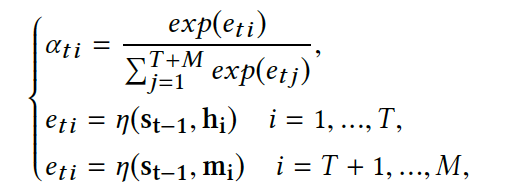

$d_v^k$表示keyword 词典的大小，$W_k \in R^{d_v^k*d_h}$,$b_k \in R^{d_v^k}$是映射层的参数，$\sigma_s$表示softmax层，$k_t^p$表示第i个预测得到的关键词，$o_t^k$表示关键词的ont-hot向量

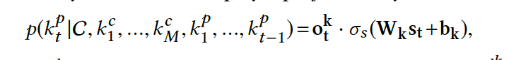

### 3.4.Deep Channel

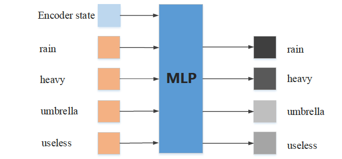

*图 4：深度通道关键词的选择过程。MLP 模型以编码器的隐藏状态与上下文关键词作为输入，然后输出每一个关键词的权重。*

Deep channel的目标是从上下文中选择有用的关键字来深化感兴趣的主题。 使用RELU作为激活函数的MLP模型来计算上下文关键字的权重。 输入是编码器的最后隐藏状态和上下文关键字的嵌入向量。 输出由下式给出

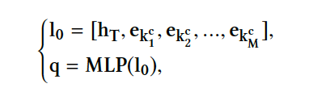

$q \in R^M$表示上下文关键字的权重，MLP模型由四层神经元实现，这四层神经元在前三层中具有rulu激活函数，在输出层中具有sigmoid。 所选关键字的向量将更新
$$
m_i = q_iW_te_{k_i^c}
$$
该通道中所选关键字的矢量将用于解码器中以生成响应。

### 3.5.Decoder

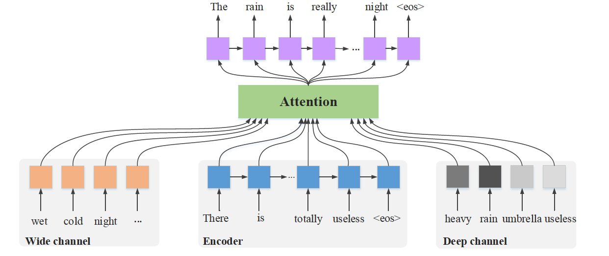

*图 3：解码器。该解码器由编码器的最后一个隐藏状态初始化，并使用该编码器的隐藏状态的输入、深度通道选择的关键词和宽度通道预测的关键词来生成回复。*

如图3所示，用于响应生成的RNN解码器类似于关键字预测的但是向量c不同，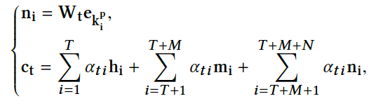

其中$N$是预测关键字的数量，$e_{k^p_i}$是第$i$个预测关键字的嵌入向量，$W_t \in R^{d_h*d_e}$是变换矩阵，与wide channel相同，通过投影获取$n_i$。 给定编码器和向量c的最后隐藏状态，解码器RNN逐token地预测目标响应。

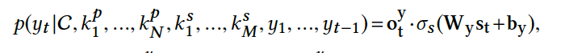

$W_y \in R^{d_v^y *d_h}$,$b_y \in R^{d_v^y}$是映射层的参数，$d_v^y$是词典的大小，$k^s_i$表示第i个选择的关键词的represents,$y_t$表示回复的第t个token，$\sigma_s$是softmax函数，$o_t^y$是$y_t$的one-hot 向量。

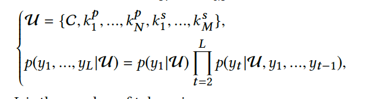

### 3.6. Loss Function

$\theta $ 表示整个模型的参数集合， $\theta $通过 $D = {(C_i, K_i^c,K_i^p,K^s_i,R_i)}_{i=1}^{i=I}$，其中，他们分别表示context，contextual keywords,predicted keywords,selected keywords和回复。


其中，$  \beta_1$和$ \beta _2$ 是目标函数的两个参数，$l_0,l_1,l_2$分别对应于 response decoder，wide channel，deep channel的目标函数。

## 四.实验

**4.1.数据集**：DailyDialog和新浪微博数据集。

在这两个数据集中，最后一个话语被用作回复，剩下的话语被视为上下文。 回复中的关键字分为两类：the predicted keywords and the selected ones.。  the selected ones直接与当前主题相关，并显示在上下文中; 而the predicted keywords与主题相关，但不一定在上下文中出现。

**4.2.实验设置**

**超参数**

在实验中，从每个对话的上下文中提取了至少五个关键字，并从每个对话的回复中提取了两个关键字。

- 词嵌入的维度被设置为100，嵌入矩阵被随机地初始化。

-  DailyDialog中的词汇量为20,000，新浪微博会话语料库中的词汇量为40,000。 词汇表中的所有未登录词都映射到特殊标记UNK。

-  RNN具有4层GRU结构，每层有1024个隐藏单元。 wide channel中的MLP模型分别在前三层包含1,024,512,128个节点。

-  优化目标函数Adam，学习率初始化为0.001，其在训练中动态地改变。

-  在目标函数l中，基于回答的困惑，我们最终从{β1，β2}∈{{0.25,0.25}，{0.5,0.5}，{0.75,0.75}，{1， 1}}选择了{0.5，0.5}。 

- 在训练中，使用验证集来early stop。

**评价指标 **

遵循现有的研究方法采用了几种标准的度量标准：困惑度（PPL），BLEU 和基于Distinct-1的多样性标准。

**基准算法**

- SEQ2SEQ +attention：基于注意的SEQ2SEQ在许多NLP任务中表现出了良好的性能，并且广泛用作基于生成对话系统的基准。 以下表示为SEQ2SEQ。
- HRED：HRED [19]能够通过对分层RNN中的上下文进行建模，在长时间内捕获有用的信息。 它已经在多回合对话系统中证明了它的有效性。
- VHRED：基于HRED，VHRED也是一种基于神经网络的生成模型，但具有潜在随机变量。 在以前的工作中，VHRED表现更好，并有助于产生长期反应。

**4.3.整体性能**

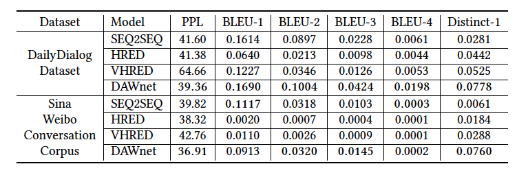

表 2：DAWnet 与基准方法在 DailyDialog 数据集和新浪微博对话语料库上的表现比较。

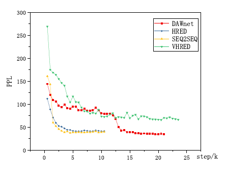

图5：DailyDialog数据集上训练步骤的PPL曲线。

从表2中，我们可以观察到以下几点：1）DAWnet在两个数据集上PPL最低。有利的表现证明，预测和选择的关键字实际上提供了更多的信息来利用模型; 2）较高的BLEU值表明回复更接近实际情况。在新浪微博对话语料库中，VHRED，DAWnet和特别是HRED在BLEU方面表现不佳。事实上，已经有研究证明BLEU与人类评估之间的弱相关性。我们还发现HRED，VHRED和DAWnet的许多反应是合理的，但与给定答案相差甚远; 3）DAWnet的Distinct-1值远远高于所有的基线，这表明DAWnet可以产生更多不同的单词，因此反应更加多样化。广泛和深度渠道中丰富的关键字确保响应的多样性。

**4.4.主观评价**

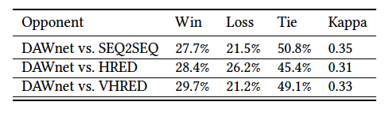

图3：主观评价的结果

从两个数据集中随机的选取了500个samples,对于每个实例，使用DAWnet和baselines来生成回复。共得到3,000个tripes((sample, response1, response2)，其中一个响应由DAWnet产生，另一个响应由baseline中的一个模型产生。然后，邀请三名本科生按照规则对每个三元组进行注释：

规则：1）注释者对于模型是未知的; 2）每个注释者需要独立评分win，lose和tie（win：反应1更好;loss：反应2更好;tie：他们同样好或不好）; 3）标注前，注释人员接受少量样本的培训，要求他们综合考虑四个因素：相关性，逻辑一致性，流畅性和信息性; 4）采用多数投票策略来判断哪一个更好。值得注意的是，如果三位注释者评价三种不同的选项，我们将这个三重数字计为“平局”。表3总结了主观评估的结果。 kappa分数表明注释者在判决中达成了一个公平的协议。

从表3可以看出：1）DAWnet优于基线。 在三条基线中，SEQ2SEQ表现最差，HRED表现最好。 分析了基线的不利情况。 SEQ2SEQ生成的响应不是有效的或逻辑的。 HRED往往会产生一般性和较少信息性的反应，例如“好”和“确定”。 VHRED产生的反应通常很长且信息丰富，但其中大部分与上下文无关。 而且2）超过45％的tripes被标记为“tie”。 通过检查这些样本，我们发现其中大多数不合逻辑或不相关。

**4.5.实例研究**

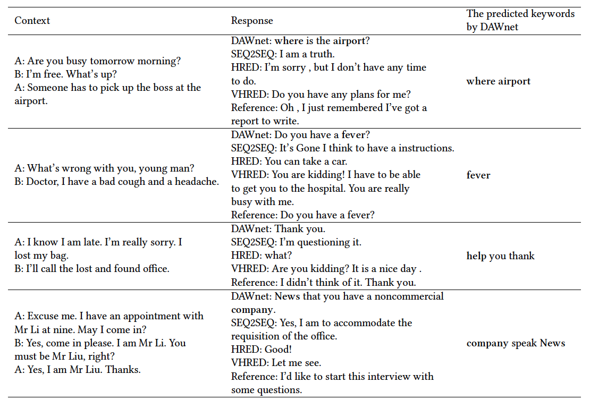

*表 4：DAWnet 和基准方法的测试样本。这里的参考答复（reference）是指数据集中的目标答复*

分析：1）在第一个样本中，HRED的反应是合理的，但与“i am free”的背景相冲突。 SEQ2SEQ和VHRED的反应很有效，但它们与上下文无关。 DAWnet预测关键词“where”和“airport”，并生成“机场在哪里？”作为回应，这是合理的; 2）第二个样本中VHRED的反应解释了我们先前的结论，即VHRED倾向于产生长时间的信息反馈，但与上下文无关。在这种情况下，DAWnet预测相关的关键字“fever”，这有助于产生良好的响应。它表明，wide channel表现良好，因此DAWnet能够拓宽话题; 3）DAWnet在第三个样本中预测关键字“help”，并通过本质生成“谢谢”作为回应。这意味着它预测“我会打电话给失物招领办公室”。这是一种帮助，广泛的渠道起着举足轻重的作用; 4）第四种情况是DAWnet测试样本中典型且有争议的例子。 DAWnet的反应似乎转移了话题，但实际上在连贯性和语法上存在一些问题。这是因为它可能受到预测关键字的很大影响，并且它们主导了解码器的响应生成。

**抽查实验**

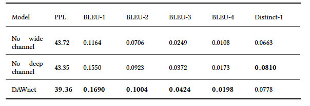

图5：抽查实验

从表5中的结果中我们观察到：1）当我们移除wide channel或deep channel时，性能下降，表明宽频道和深频道对于改善性能是不可或缺的; 2）当我们移除deep channel时，Distinct-1值增加。只有广泛渠道的模型倾向于产生一些相关但不同的词。受这些词的影响，模型倾向于转移话题，这可以解释这一现象。但是，如果宽频道主导解码器产生响应，则整个会话期间的一致性和相关性可能变差。表4中的第四种情况显示了这个问题的一个例子。因此，广泛和深度渠道之间的平衡至关重要。

**错误分析**

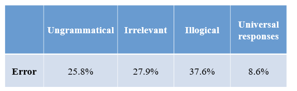

坏的情况分为四类：不合语言的反应，不相关的反应，不合逻辑的反应和普遍的反应。不合语法的反应是指那些没有语言错误和语法错误的反应。如果答复很有效但与上下文无关，我将其称为不相关的答复。不合逻辑的反应意味着它是有效的和相关的，但它与自身或逻辑中给定的上下文相冲突。普遍的反应是不太丰富和普遍的，例如“我不知道”或“好”。表6给出了四种不利案例的解释。对于具体的定量分析，不合语法，不相关，不合逻辑和普遍反应分别占据25.8％，27.9％，37.6％和8.6％。结果表明：1）DAWnet产生的通用反应较少; 2）虽然背景，预测和选择的关键词提供了丰富的对话历史信息，但该模型仍然难以完美地产生有效和相关的反应。 3）逻辑问题在坏的情况下是一个特别严重的问题。事实上，逻辑问题是神经语言生成模型中最具挑战性的问题之一。

## 五. 未来工作

**结论**：

1）wide和deep的channel鼓励所产生的回复的多样性和信息量; 

2）宽信道能够转移主题但是如果较宽的关键字在解码器中主导响应生成，则与上下文的相关性可能下降。因此，deep通道在该方案中是必不可少的。
作为未来的工作，我们将阐明响应与历史背景之间的逻辑和语义一致性。


**未来工作**

- 考虑情绪
- 提升逻辑和语义一致性
- Word extraction + Phrase extraction

