# Hierarchical-Pointer Generator Memory Network for Task Oriented Dialog 论文笔记


原文地址：https://arxiv.org/abs/1805.01216

来源：arxiv

作者：IBM研究院

## 1.研究背景

对话系统大致分为两种

- open domain（chatbot）
  - retrieval 
  - generation
- task oriented dialog system（需要结合知识库）
  - pipeline （modular model）
  - end-to-end trainable

其中，端到端的任务驱动型对话系统可以从两个方向探讨：

- 解码

  - 生成式方法的改进
  - 检索式方法的改进

- 编码（怎样更好地表示对话历史和KB三元组）

  - set of sets：表示将过去的对话内容的所有word放入词袋模型，这种方法难以捕捉上下文，也难以使用在训练阶段未见的单词工作；
  - sequence of sequence：对KB元组也强制赋予了次序，这使得在多个KB元组上执行推理变得很困难。

检索式方法在提供样本回复的时候效果比较好，因为这种方法没有能力生成新的回复；

生成式方法一般使用seq2seq模型一个token一个token的按照时间顺序生成答案，pointer的引入一定程度上解决了OOV问题。

## 2. 问题

- task oriented 对话系统受到未登录词（OOV）问题的影响——网络可能看不到知识库（KB）中的实体，在训练时，很难在对话中使用它们。 
- 使用copy机制增强的seq2seq模型具有从input复制单词的能力，这可以解决OOV问题。 但是，该模型的可学习性有限，因为它将整个对话历史记录和KB元组编码为单个序列。 另一方面，基于记忆的方法使用多跳注意力在处理大量序列方面更好。 但是他们无法从输入中复制单词会阻止它使用看不见的的KB单词生成回复。

## 3. 创新点

- 提出了一种新颖的分层指针生成器记忆网络（HyPMN），其中下一个字可以从解码词汇表生成，或者直接从保存KB结果和先前话语的分层记忆网络中复制。 这种分层记忆网络布局以及新颖的KB dropout有助于缓解OOV问题。 

- HyP-MN使用新颖的分层memory representation，其能够将KB三元组表示为一个set，并将每个话语表示为一系列单词。既可以捕获word的上下文，又可以通过KB元组执行推理。

- 用分层记忆机制，维持两个级别的寻址 - 在话语级别和单词级别。 它还通过双向RNN将话语编码为序列来扩展现有MN架构的bag-of-word话语编码。 

- 提出KB-dropout相结合，允许模型有效地学习每个单词周围的上下文线索，这对于选择要复制的最佳下一个单词非常有用。

## 4.与Mem2Seq的区别

Mem2seq 在第4篇论文中详细介绍

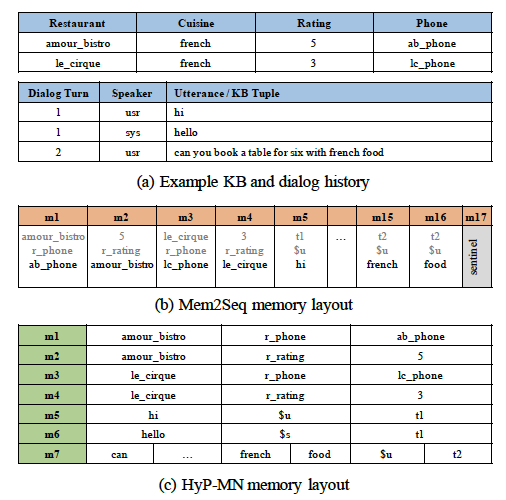

图1：(a)带有历史记录和KB元组的示例对话。（b）Mem2Seq存储器的图示。 （c）HyP-MN记忆的图示

二者的模型都是mem network+pointer 结合了多跳注意和复制机制。 

这意味着Mem2Seq的复制机制只能指向特定的KB元组，但由于Mem2Seq中的memory是flat representation（同一层次平面的表示），其部分在utterance级别，部分在word级别操作。 特别地，用户/机器话语的各个单词存储在它们自己的存储器单元中，而KB元组仅获得一个存储器单元。它对如何构造KB事实做出了具体的假设，并且只允许复制事实对象位置的实体，不能指向元组的特定组成部分。

> 例如：kb中的一个三元组<海底捞，招牌菜，火锅>那么只能复制火锅，火锅就是事实对象
>
>  例如，存储元件m1包含完整的KB元组，而m15仅包含来自第二用户话语的单词“french”。

为了只允许元组的“对象”实体用于response选择，Mem2Seq必须进行第二次建模选择。 这导致Mem2Seq可能有用的场景的三个限制：

首先，Mem2Seq期望KB API将每个元组序列化为模型可以使用的方式，现实场景中难以实现。

其次，因为每句话中的每个token都有一个单独的记忆单元，无法利用提到这个词的背景（上下文）。

>就像是词袋模型一样：失去了上下文
>
>例如对于一句话’‘’may i help u‘
>
>在mem2seq中是每个memory中存入一个word，而在HyP-MN中可以在一个m中存入一句话，这句话中又保留了每个token的自身

最后，模型设计规定在解码步骤期间永远不能复制来自KB事实的主语或谓词。这在实际环境中增加了严重的限制。

> 例如，KB导致原始bAbI数据集以属性（餐馆名称，餐馆属性）的格式出现。由于餐馆名称永远不是一个对象，因此Mem2Seq在提出建议时永远无法复制它。因此，使用Mem2Seq进行实验需要进行训练数据预处理，其中所有评级事实必须反转为评级（餐馆评级，餐馆名称），以便名称可以成为对象并且可以被复制。

与之 相反，HyP-MN不对KB结构做出任何假设，并且可以根据其上下文从对话历史中复制任何单词。1.我们提出了一种新颖的HyP-MN架构，它结合了记忆网络的multi-hop attention和copy机制，实现更好的OOV泛化。

## 5.模型

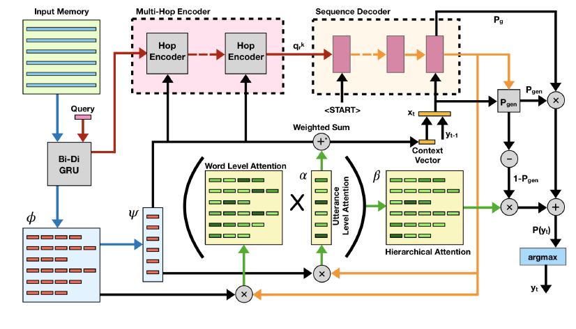

HyP-MN包括一个multi-hop编码器和copy机制增强的序列解码器，如图2所示。网络将其所有上下文和KB元组保存在分层存储器中。

模型输入：用户说的话$\{c_1^u,c_2^u,.....,c_t^u\}$,系统回答$\{c_1^s,c_2^s,.....,c_{t-1}^s\}$,KB三元组$\{kb_1,kb_2,.....,kb_N\}$

模型输出：第t轮系统输出$c_t^s =<y_1y_2...y_T>$

### 5.1.Hierarchical Memory

memory $M=\{m_i\}$,包含对话历史 $\{c^u_1,c_1^s,....,c_{t-1}^u,c_{t-1}^s\}$和KB三元组$\{kb_1,kb_2,....,kb_N\}$，其中每一个元素都匹配到一个单独的记忆单元。

每个记忆单元$m_i$存储有序的序列$<w_i^1,w_i^2,....w_i^{|m_i|}>$,

>如果是一句话，例如“how may i help you”
>
>$m_i$中为  how|may|I|help|you|#1|$s
>
>$s代表这句话是系统说的，#1代表这是第一句话

memory的作用是为了存储编码器编码的到目前为止对话历史的向量表示，也是为了方便解码器直接复制token。

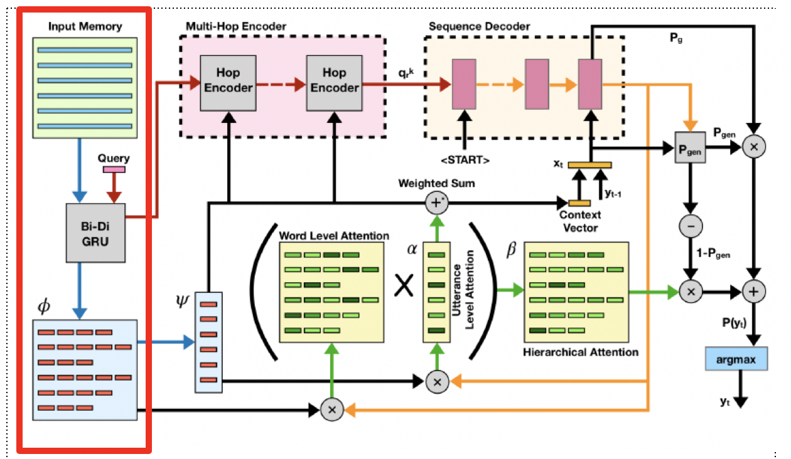

Utterance 向量表示通过一个单层的双向GRU生成，对于$w_i^j$来说，经过双向GRU分别表示为$[\underset{h_{ij}}{\rightarrow},\underset{h_{ij}}{\leftarrow}]$。

$w_i^j$的d维上下文依赖向量表示：$\phi(w_i^j) =[\underset{h_{ij}}{\rightarrow},\underset{h_{ij}}{\leftarrow}]$

记忆单元$m_i$存储的向量表示：$\varphi(m_i)=[\underset{h_{j{[m_i]}}}{\rightarrow},\underset{h_{ij}}{\leftarrow}] $

### 5.2.The HyP-MN Encoder

HyP-MN中使用的编码器类似于具有分层权重的multi-hop attention encoder。编码器使用两个不同的嵌入矩阵，因为我们只使用一个来减少参数的数量。

**input**：编码器接收最后一句用户说的话作为查询向量$q =\varphi{(c^u_t)}$并使用存储器M计算压缩的向量表示$q^k_r$，如下所示：

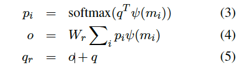

其中，$W_r \in R^{d*d}$。

把上一层hop的输出作为下一层hop的输入，经过在所有hop层迭代之后，设置$q=q_r$。

**output:** 经过K次hop迭代之后，得到$q_r^k$，作为解码器的原始输入。

### 5.3.The HyP-MN Decoder

HyP-MN复制机制增强的序列解码器，一次生成一个字。在时刻t，解码器可以从词汇表中生成一个字或者从memory中复制一个字。

在每个解码步骤中，解码器计算：（1）在解码词汇表上的生成分布$P_g(y_t)$;(2)在memory上的复制分布$P_c(y_t)$。

$P_g(y_t)$通过添加了在memory上计算的utterance-level的注意力**(ULA)**的标准序列解码器来计算；

$P_c(y_t)$复制分布通过分层地获取单词级别关注**（WLA）**（Luong等人，2015）和先前计算的**ULA**的乘积来生成，如下：

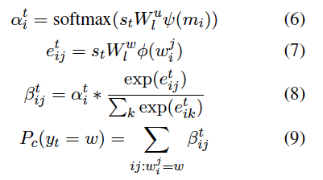

其中,$W^w; W^u$是可学习的参数，$s_t$是时间$t$的解码器状态并且表示softmax函数。

层次关注有助于复制分布在生成注意权重时了解上下文。

通过使用软门$p_gen \in [0,1]$。最后的分布是解码词汇表中的单词和存储器中存在的单词的结合。

## 5.4. Loss

loss函数是最小化回复中所有单词的平均负对数似然函数。除此之外，我们还添加了基于$p_{gen}$的交叉熵项。损失如下：

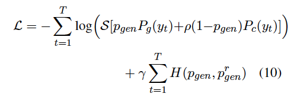


其中。$S$代表softmax函数，T是回复中word的position。

这是通过使用参考分布$p^r_{gen}$来实现的，如果回复中的单词是KB中的wod，则设置为0，否则设置为1。超参数有助于在训练的初始部分中定义对副本或生成的偏差。$\rho  > 1$偏差复制，而$\rho <1$偏差生成。另一个超参数$\gamma $
有助于确定两项之间的相对重要性。

### 5.5. KB Dropout

如3.1节所述，使用双向GRU生成单词的向量表示$\phi(w_i^j) $。为了使模型对OOV更具有鲁棒性，我们期望GRU在表示KB中的word的时候捕获必要的上下文，而不是仅依赖于该kb的向量表示。我们强制GRU通过在训练期间模拟OOV字来学习上下文，即在每次迭代期间在对话历史中随机丢弃一些KB字符。
这有助于模型在生成回复的时候根据GRU学习的上下文复制KB 中的token。

## 6.实验

### 6.1.数据库

- bAbI dialog dataset

  - 5个task，第5个task是前四个task的组合。KB被分成2份，一份用来生成训练集，验证集和测试集，另一部分用来生成OOV测试集。

- DTSC2

  - 餐厅预定的人机对话数据集

- CamRest676 dataset

  用于餐厅预订的人 - 人对话数据集。使用Wiz-of-Oz框架收集的。

- In-Car Assistant dataset

### 6.2.评估方法

- per-response accuracy :生成的回复和真实回复的相同程度，适用于带有标准回复的对话数据的评估，例如babi。
- Entity F1 ：
- Bleu
### 6.3.baselines

将HyP-MN与所有现有的端到端可训练任务导向对话系统进行比较。

**检索模型**：例如query reduction network （QRN）（Seo等人，2017），memory network（MN）（Bordes和Weston，2017）和gated memory network（GMN）（Liu和Perez，2017）。检索模型通常通过包含称为“+匹配类型”的特定于域的功能来报告改进的结果。为了公平比较，我们在所有检索模型中都保留此功能。

**生成模型**：seq2seq，seq2Seq + Attn， Seq2Seq+Attn (Ptr-Unk)

```
为了模型之间的公平性，不会与需要额外实体类型信息的生成方法（Eric和Manning，2017; Eric等，2017）或其他中间标签（Wen et al。，2017）进行比较。最后，我们还与最近提出的Mem2Seq（Madotto等，2018）进行了比较. Mem2Seq报告的结果不能直接比较，因为它们以数据集特定的方式使用预处理的训练数据（参见第2.1节）。为了直接比较，我们在原始训练数据集3（Mem2Seq *）上重新运行Mem2Seq并重复所有实验
```

## 7.结果

>```
>（1）HyP-MN的性能与现有的面向任务的对话系统相比如何
>（2）每个HyP-MN组件的贡献是什么
>```

### 7.1.与baseline的系统比较

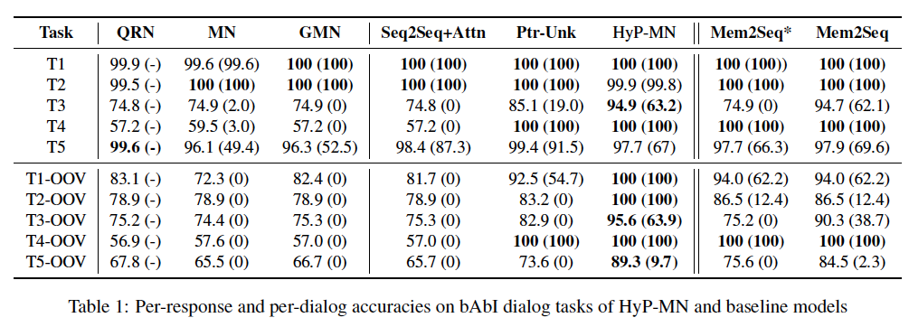

 基于检索的模型在非OOV任务上表现良好，但在OOV任务上未能表现出类似的性能。因为他们受过训练以从预定义的一组响应中检索。它们在任务3和4上的非OOV性能差是由于bAbI数据集构造中的错误，因为验证集和非OOV测试集中存在的KB实体不与训练集中的KB实体重叠。这实际上意味着任务3和4的非OOV和OOV测试条件相同。

简单的生成模型（Seq2Seq + Attn）实现了与多跳注意力相当的精度。使用复制（Ptr-Unk）机制可以显着提高性能，尤其是在OOV任务（以及非OOV任务3和4）上。

与最近提出的Mem2Seq进行了比较。如上所述，主要的比较是针对Mem2Seq *，它在未处理的训练数据上运行模型。我们还包括带有预处理（Mem2Seq）的数字以确保完整性。我们发现HyP-MN在所有OOV任务上都优于这两个模型，除了任务4，它们都是平等的。 Mem2Seq *和Mem2Seq之间的区别突出了由于假设仅复制KB元组中的对象字而导致的丢失。 HyP-MN对Mem2Seq的进一步改进可能是因为它能够捕获单词的上下文由于在话语层面使用双向RNN，因此在utterance 级别更好。

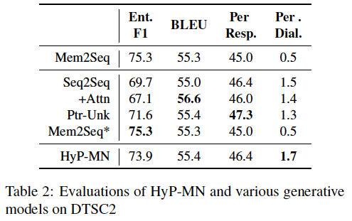

DTSC2数据由于是人与机器交互生成的，存在很大的噪声，例如，训练数据中的一条例子：当user询问餐厅的电话号码的时候，及其回复，你正在寻找餐厅吗？这增加了任务的困难程度。

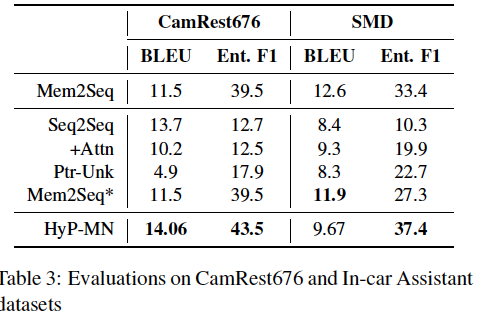

在车载辅助数据集中，HyP-MN仅在实体F1指标上优于基线。我们分析了HyP MN的性能并观察到HyP-MN的响应经常从KB传达必要的实体信息。但是，他们使用与真实回答几乎没有词汇重叠的短语，从而降低了BLEU分数。

### 7.2.抽插实验

从基本模型开始逐步添加模块来评估每个模块的作用，基本模型使用多跳注意编码和复制机制来解码。

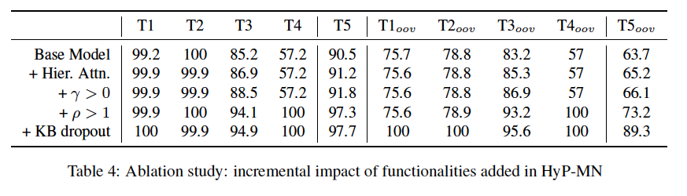

基本模型仅使用WLA（与论文中提出的WLA和ULA的结合相比较），无论是生成还是复制（p= 1，p= 0）都是无偏的，并且没有KB dropout的训练。 表4报告了针对bAbI对话任务的各种HyP-MN配置的每轮回复准确度分数。 由于任务5是任务1到4的组合，因此前四个任务之一的性能提升将反映在任务5中。

**Hierarchical Attention:**这个选择主要有助于任务3.因为任务三的性质（1）它是唯一需要对KB结果进行推理的任务。 这是因为推荐回答必须推断用户已经拒绝的评级订单和餐馆，并且接下来推荐排名最高的未拒绝餐馆。 （2）建议餐厅是餐厅推荐的整个任务的关键一步; 做到这一点对于用户对系统满意至关重要。 

**Hyper-parameters in Loss: **损失中的超参数。$\gamma 和\rho $在生成回复时从KB中copy单词时。$\gamma>0$代表希望从KB中copy单词，但是这对于需要大量copy kb中token的task3，4只有微小的改善，由于回复中的非KB字数与KB字数相比更高，因此在训练的初始阶段，系统倾向于支持生成而不是复制。 这表明我们必须添加先验优先复制操作。
我们通过引入$\rho$参数。$\rho>1$值导致任务3和4提升。.

**KB dropout**：是的可以捕获kb中token的上下文信息。

## 8.讨论

### 8.1.分层注意力

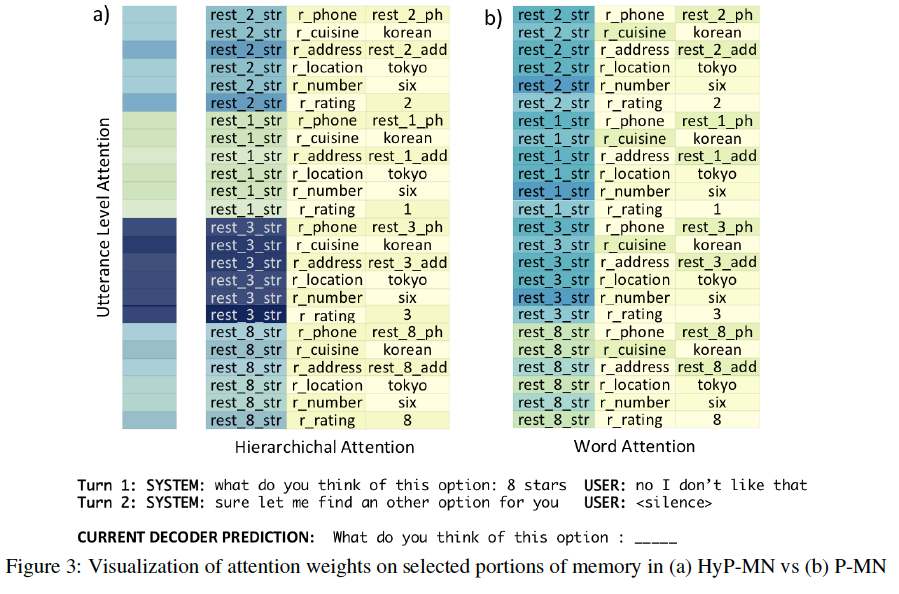

上图中，（a)图示HyP-MN，（b)图示P-MN，区别在于拷贝的方式，P-MN仅使用WLA，HyP-MN是ULA和WLA的产物。

上图的实例找那个，旨在预测第二好的三星级餐厅，并且已经建议并拒绝了8星的餐厅。为简洁起见，我们仅关注KB条目。这些模型在注意力分布上有一些相似之处。

都分布在餐厅名称上，两个模型都更倾向于copy而不是生成，$p_{gen}$前者是$3.14*10^{-5}$,后者是$1.15*10^{-4}$,此外，具有相同餐馆名称的条目具有相似的注意力，反映了分布的稳健性。

我们还观察到HyP-MN能够执行根据评级（星数）的降序排序餐厅条目的困难任务。 它为具有高评级的条目赋予更多权重并且抑制任何先前建议的餐厅的权重，例如8星。 ULA为HyP-MN提供了推断多组元组的能力。 通过注意热图可以观察到ULA对餐馆进行分类并拒绝先前看过的餐馆的能力。 另一方面，WLA可以将注意力权重推向KB元组中的餐馆。 因此，结合使用两者有助于HyP-MN比P-MN更好地执行。

### 8.2.Capturing Context via KB dropout

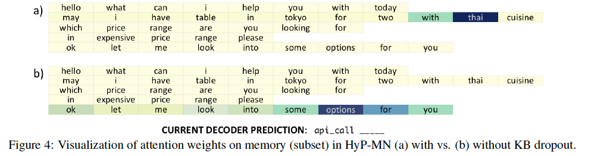

语境在自然语言理解中起着重要作用。在没有重要上下文线索的情况下，一个单词的语义有时是模棱两可的。为了成功建模我们的OOV任务，模型必须能够使用这些线索来确定未知单词的含义。

在图4中，我们比较了在任务1的训练期间引入随机dropout对KB字的影响。我们比较了有和没有KB丢失的HyP-MN。 在这个例子中，解码器必须为API调用挑选正确的菜肴，它本身就是一个OOV。

 我们看到输入话语的不同单词的注意力明显不同。 Dropout增强模型能够从周围的单词中清楚地指出从未见过的美食。 第二个模型为看似随机和无趣的单词赋予权重，可能是因为它完全依赖于单词的向量表示来复制它。 像“泰国”这样的未知单词模型并没有将其识别为菜肴。

### 8.3.Qualitative Analysis of Real Datasets

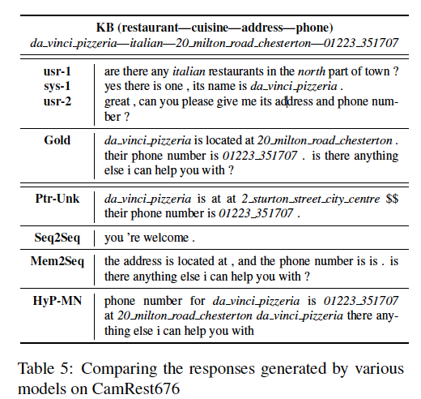

上图比较了来自四个不同模型的输出回复。 每个回复中的重要KB实体都用斜体表示强调。
我们希望对话系统向用户提供所需信息 为： 达芬奇比萨店的地址和电话号码。

 Ptr-Unk能够指向所请求的电话号码，但会生成错误的地址。 Seq2Seq生成与对话框上下文无关的响应。 Mem2Seq已经学会生成一个非常易读的响应，类似于基本事实，但未能从KB中选择必要的实体。 最后，HyP-MN能够复制必要的实体 - 达芬奇比萨店的地址和电话号码（高实体F1得分），同时生成响应，但不会产生最可读的响应。 但是，它设法生成对用户最有用的回答。

## 9.贡献

1.我们提出了一种新颖的HyP-MN架构，它结合了记忆网络的multi-hop attention和copy机制。

2.HyP-MN使用新颖的分层memory representation，其能够将KB三元组表示为一个set，并将每个话语表示为一系列单词。
3.我们在多个数据集上显示最先进的结果，包括当KB具有看不见的单词时对bAbI对话框数据集的10％改进。


