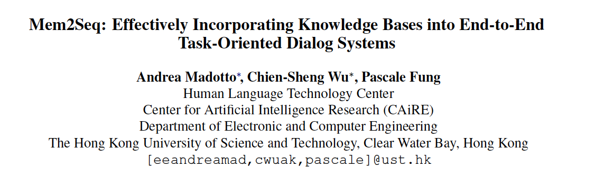

## 一.Overview

论文地址：[http://cn.arxiv.org/pdf/1804.08217v3](https://link.zhihu.com/?target=http%3A//cn.arxiv.org/pdf/1804.08217v3)

作者：Andrea Madotto, Chien-Sheng Wu, Pascale Fung

来源：ACL 2018

代码链接：[https://github.com/HLTCHKUST/Mem2Seq](https://link.zhihu.com/?target=https%3A//github.com/HLTCHKUST/Mem2Seq)

本文的主要思路是用memory来记录下过去的回答历史和KB三元组信息，并设定一哨兵来判断是否可以从memory的对话历史或者KB中直接复制token。如果不能，则用一语言模型来生成下一个token。

Mem2Seq是第一个结合了multi-hop attention机制和指针网络（pointer network)的生成网络模型。

## 二.Background

task-oriented dialog与chatbot的一个重要区别就是：后者基于dialog history生成response，而前者生成回复不仅仅基于dialog history还要根据对KB中的信息查询结果。

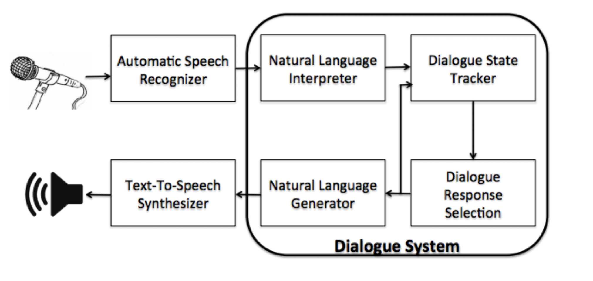

**传统的任务驱动型对话**通常都是**流水线模块**的：包括语言理解，对话管理，知识库查询，和语言生成模块等。流水线模型结合了领域知识并通过填充slot技术效果比较稳定，但是各个模块之间的依赖性很复杂，并且KB查询需要人为参与工程量较大。

**端对端对话系统**可以直接将纯文本对话历史映射到输出的response中，并且不需要人工设计的状态标签引起了极大关注，基于注意力的复制机制的提出可以使得，即使未知token出现在对话历史中，模型仍然能够生成正确且相关的实体，进一步促进了其发展。

## 三.Motivation
- 之前的端对端对话系统仍然面临着一些**问题**：

  - 因为RNN对于长序列是不稳定的。所以难以有效地将外部知识库信息与RNN隐藏状态相结合。
  - 处理长序列非常耗时，尤其是在使用注意力机制时

- 端到端的记忆网络（MemNN）在推理任务上表现很好，通过将外部存储器嵌入几个embedding 矩阵，并使用查询向量反复的读取存储器。能够记忆外部知识库信息并且快速编码长对话历史记录。

- MemNN只是从预定义的候选池中选择输出响应，而不是逐字生成，并且Memory query需要显示设计而不是被学习，也缺乏复制机制。

## 四.Contribution ##

- Mem2Seq首次将多跳注意力机制与指针网络结合，并允许我们有效地结合知识库信息。

- Mem2Seq学习了如何动态生成查询去控制Memory的访问，可以可视化memory控制器和attention的跳跃之间的模型动态。

- Mem2Seq可以更快地进行训练，并在几个任务型对话数据集中实现最先进的结果。

## 五.Model

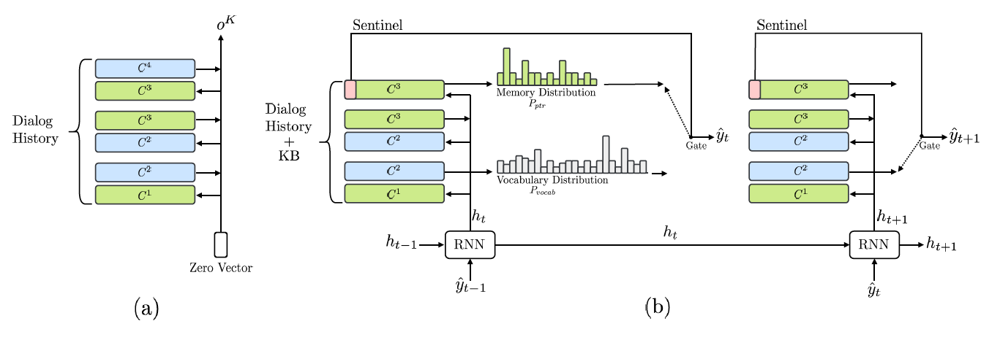

图一：本文提出的任务驱动型多轮对话系统的Mem2Seq框架.(a)有3个hop的memory编码器；(b)超过2步的生成式memory解码器

### 5.1.模型概览

Mem2Seq是第一个结合了multi-hop attention机制和指针网络（pointer network)的生成网络模型。

简单来说，Mem2Seq=MemNN+pointer network，由两个组件组成：memory encoder和memory decoder。如图1所示，MemNN编码器创建对话历史的矢量表示。 然后，存储器解码器读取并复制存储器以产生响应。

**定义**：

对话历史中的所有单词表示 $X=\{x_{1},x_{2},...,x_{n},\$\}$ ,其中$\$$ 是sentinel（哨兵)。即，如果选择了$\$$则从 $P_{vocab}$中生成标记,否则从 $P_{ptr}$中生成标记。这个标记用作hard gate来控制在每个时间步使用哪个分布。我们在X的每个标记中添加时态信息和说话者信息以捕获序列依赖性。 

> 例如，“hello t1 $ u”表示用户在时间步骤1说的“hello”。
>
> 实际处理的时候对于每一句话例如 “how are you"
>
> 会处理成为[[how t1 \$u],[are t1 \$u],[you t1 \$u]]

定义知识库元组 $B={ b_{1},b_{2},...,b_{l} }$。使用（subject, relation, object）来表示。 

> 比如，我们表示KB中的三元组信息（The Westin, Distance, 5 miles）。通过对subject, relation和object的词向量进行求和，以获得每个知识库的memory表示。 在解码阶段,object部分用作 $P_{ptr}$的生成字。 例如，当指向知识库元组（The Westin, Distance, 5 miles）时，我们的模型将“5 miles”复制为输出字。

定义Memory编码器的输入为 $U=[ B;X ]$，是两个集合的串联。

定义Memory解码器的输入为 $o^{K}$，同时也是Memory编码器的输出。

定义预期系统的输出响应为 $Y= \{ y_{1},y_{2},...,y_{m} \}$ 。

定义指针网络的指针索引集为 $PTR=\{ ptr_{1},...,ptr_{m} \}$，计算公式如下

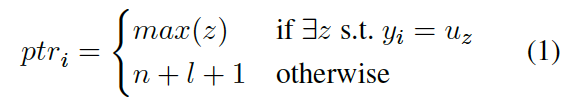

当$y_i$是指针在memory中生成的时候，$ptr_i = max(z)$,如果是从词汇表中生成的，则$ptr_i = n+l+1$也就是memory的最后一个位置，哨兵的位置

### 5.2. memory encoder

输入：$U$

输出： $o^{K}$

MemNN的存储器由一组可训练的embedding矩阵 $C=\{ C^{1},...,C^{K+1} \}$ ，$C \in R^{vocab\_size*embedding\_size}$组成，其中每个 $C^{k}$将输入的词汇表中的token映射为向量，查询向量  用作读取头。模型在K hops上循环，并使用以下方法计算每个内存i在第k跳的注意力权重：
$$
p_i^k = Softmax((q^k)^TC_i^k)
$$
其中， $q^k \in R^{d*1},C_i^k \in R^{d*1}, p_i^k \in R^1$

其中，  是位置i处的存储内容，且进行softmax操作
$$
Softmax(z_i) = e^{z_i}/ \sum_je^{z_j}
$$
对于C中每一个word embedding 都计算出attention。

 决定了关于查询向量  的存储器相关性，模型通过  的加权和读出内存  。然后，使用  为下一跳更新查询向量。
$$
o^k = \sum_i p_i^kC^{k+1}_i
$$

>note：o的上标是k，C的上标是k+1，第k+1 hop 的权重由第k层决定。

$$
q^{k+1} = q^k + o^k
$$

$o^k$作为decode步骤的原始输入

### 5.3. memory decoder

解码器使用RNN和MemNN。 MemNN加载了X和B，因为我们使用对话历史和知识库信息来生成适当的系统响应。

门控循环单元（GRU）用作MemNN的动态查询生成器。

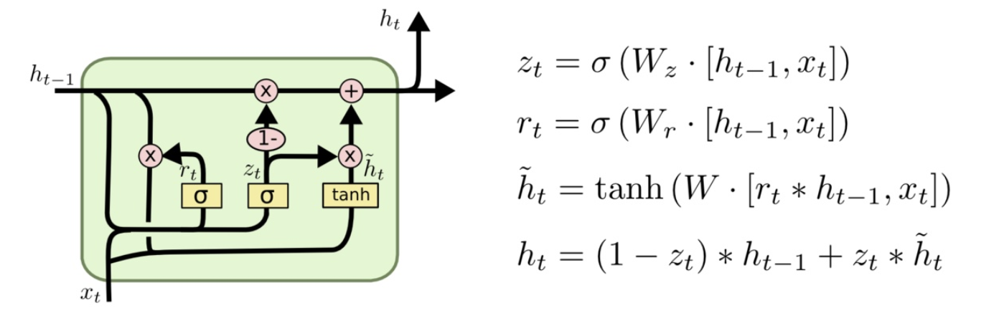

在每个解码步骤t，GRU获得先前生成的单词和先前的查询作为输入，并且输出为新的查询向量。形式上：
$$
h_t =GRU(C^1(\hat y_{t-1}),h_{t-1})
$$
然后将查询  传递给将产生标记的MemNN，其中  。 在每个时间步，生成两个分布：一个基于词汇表中的所有单词（  ），一个基于memory内容（  ），也就是对话历史和知识库信息。

一方面是  ，它是通过连接读出的第一跳注意力和当前查询向量生成的。
$$
P_{vocab}(\hat y_t) = Softmax(W_1[h_t;o^1])
$$
其中  是可训练的参数。

另一方面，使用解码器的最后一个MemNN跳处的注意力权重来生成  。 我们的解码器通过指向存储器中的输入字来生成标记，这是与指针网络中使用的注意力类似的机制。

综上，第一跳更侧重于检索memory信息，最后一跳倾向于选择利用指针监督的精确标记。

Mem2seq模型期望第一跳和最后一跳的注意力分别显示“looser”和“sharper”的分布。 详细说明，第一跳更侧重于检索内存信息，最后一跳倾向于选择利用指针监督的精确token。 因此，在训练期间，通过最小化两个标准交叉熵损失的总和来共同学习所有参数：

- $P_{vocab}(\hat y_t) $和$y_t \in Y$即在词汇表分布上的交叉熵

- $P_{ptr}(\hat y_t)$和$ptr_t \in PTR$在memory上分布的交叉熵
>如果预期的单词没有出现在记忆中，那么$P_{ptr}$会被训练以产生标记符号\$。一旦选择了哨兵，我们的模型就会从$P_{vocab}$生成标记，否则，它会占用内存内容使用$P_{ptr}$分布。 基本上，标记令牌用作硬门来控制在每个时间步使用哪个分布。 在（Merity等，2017）中使用了类似的方法来控制语言建模任务中的软门。 

## 6.实验

### 6.1.数据集介绍

使用了3个公开的多轮对话数据集来评估模型，分别是：the bAbI dialog(Bordes and Weston, 2017), DSTC2 (Henderson et al., 2014) 和 In-Car Assistant (Eric et al.,2017).

- bAbI数据集

bAbI数据集包括餐厅领域中的五个端到端对话学习任务。 任务1到4分别是API调用，精炼API调用，推荐选项和提供附加信息。 任务5是任务1-4的联合。 每个任务有两个测试集：一个遵循与训练集相同的分布，另一个具有训练集中不存在的词典外（OOV）实体值。

-  DSTC2数据集

与bAbI对话框的主要区别在于，此数据集是从真实的人机器人对话框中提取的，由于语音识别错误或误解导致机器人出错，因此噪声更大，更难。

-  In-Car Assistant数据集

In-Car Assistant车载助手数据集是由Amazon Mechanical Turk收集的人 - 人，多领域对话数据集。 包括三个不同的领域：日程安排，天气信息检索和兴趣点导航。 此数据集的会话转换时间较短，但用户和系统行为更加多样化。 此外，系统响应是变体的，KB信息要复杂得多。 因此，此数据集需要更强的与KB交互的能力，而不是对话状态跟踪。

### 6.2.训练

优化器：Adam

学习率：$[le^{-3},le^{-4}]$

hop层数：对于MemNN的编码器和解码器，K=1,3,5

dropout参数：$[0.1,0.4]$

随机将一些input vocab遮盖mask，以相同的dropout率模拟OOV情况

使用gripsearch来调整超参数

### 6.3.评估方法

**Per-response/dialog Accuracy**：（任务完成率）只有当生成结果与gold response完全相同时，回答才是正确的。  由于Mem2Seq单独生成每个vocab，因此使用此指标进行评估对于我们的模型来说更具挑战性。

**BLEU**： 面向任务的对话中的相关度量，因为与开放域生成不同，生成的答案之间没有很大的差异（Liu et al。，2016）。 因此，我们在评估中包括BLEU分数（即使用Moses multi-bleu.perl脚本）。

**Entity F1**：评估从提供的KB生成相关实体并捕获对话框语义的能力（Eric和Manning，2017; Eric等，2017）。 

## 七.实验结果

对比试验：

- QRN(networksquery-reduction)

- MemNN(end-toend memory networks)

- GMemNN(gated end-to-end memory networks)

baseline:

-  standard sequence-to-sequence (Seq2Seq) models without attention

- standard sequence-to-sequence (Seq2Seq) models with  attention

- standard sequence-to-sequence (Seq2Seq) models with pointer to unknown

我们的模型：

- Mem2Seq with hop 1，3，6

**bAbI Dialog**

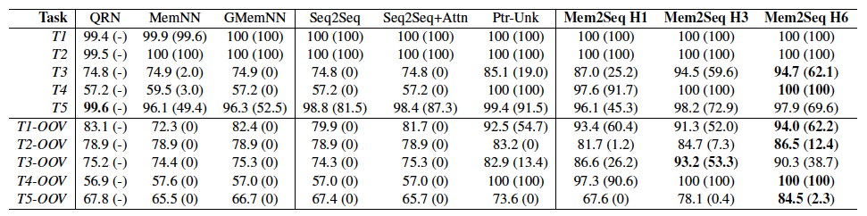

表3:bAbI 数据集上的每个response和每轮dialog（在括号中）的准确性。 Mem2Seq实现了最高的平均回复精确度，并且实现了最小的oov词汇丢失表现。

在表3中，具有6 hops的Mem2Seq在T5中可实现每次response97.9％和每轮对话69.6％的准确度，在T5-OOV中达到84.5％和2.3％，这远远超过现有方法。可以发现在特别是T3中，根据他们的排序推荐餐厅的任务，Mem2Seq可以通过指针实现很好的结果。就每个response的准确性而言，测试OOV数据的性能损失很少，其他的模型则下降了大约15-20％，这表明Mem2Seq模型可以很好地推广。 OOV数据中的性能增益也主要归因于复制机制的使用。此外，在任务3-5中证明了跳跃的有效性，因为它们需要对KB信息的推理能力。

此外，QRN，MemNN和GMemNN将bAbI对话框任务视为分类问题。虽然与生成方法相比，分类任务更容易，但Mem2Seq模型仍然可以超越性能。最后，我们可以发现Seq2Seq和Ptr-Unk模型也是强大的基线，这进一步证实了生成方法在面向任务的对话系统中也可以取得良好的性能（Eric和Manning，2017）。

**DSTC2 dialog**

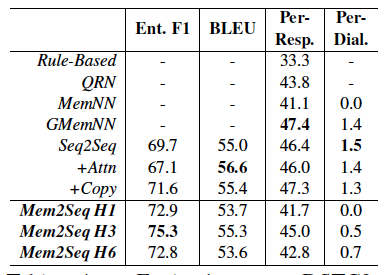

表4：DSTC2数据集上的评估

在表4中， Mem2Seq拥有最高75.3％的实体F1得分和55.3 BLEU得分的高分。 这进一步证实了Mem2Seq在使用多跳机制而不丢失语言建模的情况下可以很好地检索正确的实体。 在这里，我们不使用匹配类型（Bordes和Weston，2017）或实体类型（Eric和Manning，2017）函数报告结果，因为此元信息不常用，我们希望对普通输入输出进行评估。 人们还可以发现，Mem2Seq在其他现有解决方案中具有可比较的响应准确度（即2％边际）。 请注意，每个模型的每个响应精度小于50％，因为数据集非常嘈杂，并且很难生成与真实答案完全相同的响应。

**In-Car Assistant**

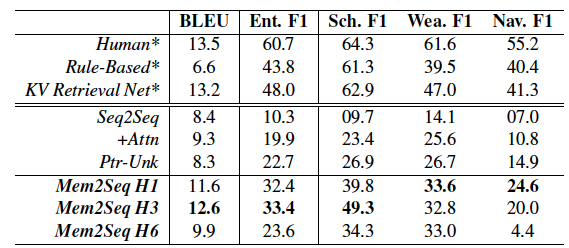

表5：对n-Car Assistant数据集的评价。（带*）报告不具有直接可比性。 Mem2Seq在基线上获得最高的BLEU和实体F1得分。

在表5中，我们的模型可以达到最高12.6 BLEU分数。 此外，Mem2Seq在实体F1得分（33.4％）方面显示出有希望的结果，一般来说，远远高于其他基线。 请注意，Eric等人报告的数字。 （2017）与我们的产品不具有直接可比性，如下所述。 其他基线（如Seq2Seq或Ptr-Unk）在此数据集中的性能尤其差，因为RNN方法编码较长KB信息的效率非常低，这是Mem2Seq的优势。

此外，我们观察到一个有趣的现象，即人类可以很容易地获得具有低BLEU分数的高实体F1分数。这意味着对实体来说（hops）更强的推理能力至关重要，但结果可能与真实答案不相似。我们相信即使BLEU评分较低，人类也能产生良好的答案，因为可能有不同的方式来表达相同的概念。因此，Mem2Seq显示了成功选择正确实体的潜力。请注意，表5中报告的KV Retrieval Net基线的结果来自In-Car Assistant的原始论文（Eric et al。，2017），他们通过使用命名实体将实体的表达式映射到规范形式来简化任务。识别（NER）和链接。因此，评估与我们的系统无法直接比较。

> 例如，他们的模型学会了产生回答，例如“你在橄榄球时间与橄榄球队进行足球比赛”，而不是产生一句话，例如“你和约翰在晚上7点有足球比赛。”因为可能会有更多不是一个足球派对或足球时间，他们的模型不学习如何访问KB，而是学习规范化的语言模型。

**Time Per-Epoch:**

每个epoch的时间：我们还比较了图2中的训练时间.使用可以实现最高性能的超参数报告每个模型。 可以观察到，对于短输入长度（bAbI对话任务1-4），训练时间没有那么不同，并且随着最大输入长度增加，间隙变得更大。 与注意力的Seq2Seq相比，InCar助手和DSTC2的Mem2Seq快5倍左右。 训练效率的这种差异主要归因于Seq2Seq模型具有限制任何并行化的输入顺序依赖性的事实。 此外，Seq2Seq模型对KB进行编码是不可避免的，而Mem2Seq仅使用对话历史进行编码。

## 八.分析和讨论

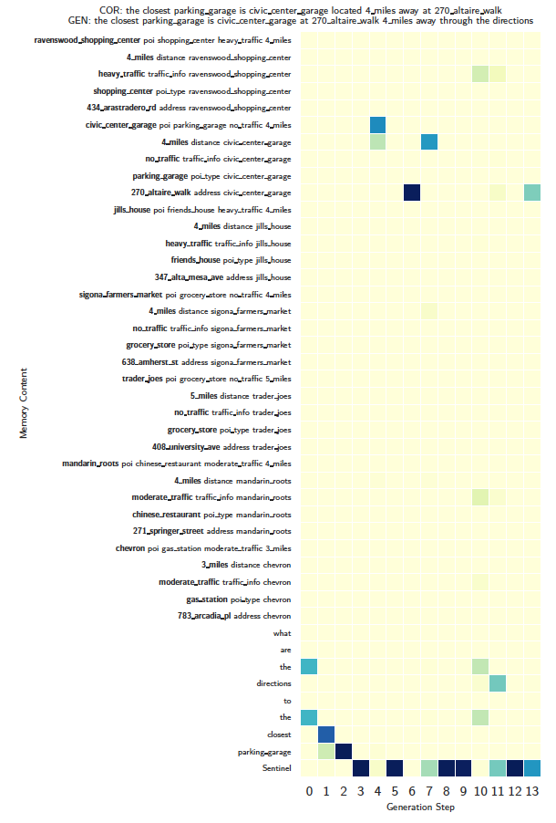

**Memory Attention**:分析注意力权重经常用于显示记忆读数，因为它是理解模型动态的直观方式。 图8显示了每个生成的token的最后一跳的注意向量。 每列代表相应生成步骤的$P_{ptr}$载体。 我们的模型在memory中具有明显的分布，这表明它能够从内存中选择正确的令牌。 例如，在第六步检索KB信息“270 altarie walk”，这是“市政中心车库”的地址。 另一方面，如果触发了哨兵，则生成的单词来自词汇分布$P_{vocab}$。 例如，第三步骤触发了哨兵，并且由于在对话历史中不存在该单词而从词汇表生成“是”。

**multiple hops**：Mem2Seq显示了多个hops如何改善不同数据集中的模型性能。 bAbI对话框数据集中的任务3用作示例，其中系统需要基于按照从最高到最低的餐馆等级向用户推荐餐馆。 用户可以拒绝推荐，系统必须推理下一个最高级别的餐厅。 我们发现不同样本之间的跳跃有两种常见模式：1）第一跳通常用于对所有相关记忆进行评分并检索信息; 2）最后一跳倾向于关注特定的token，并在注意力不明显时犯错误。 对于某些样品，这种错误可归因于缺乏hops。 有关更多信息，我们在补充材料中报告两幅图。

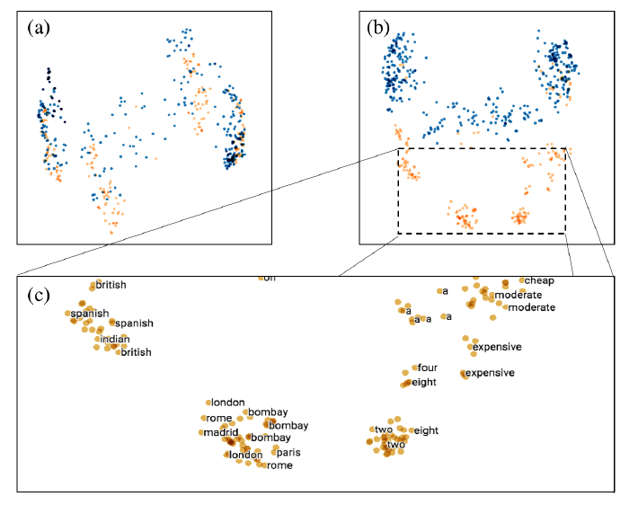

图4：对于bAbI对话，在hop（a）1和（b）6中的查询向量的主成分分析

**Query Vectors：**在图4中，针对不同的hop显示了Mem2Seq查询向量的主成分分析。 每个点代表一个查询向量$h_t$，并且它具有其对应的生成字$y_t$。 蓝点是由$P_{vocab}$产生的单词，它触发了哨兵，而橙色的点来自$P_{ptr}$。 可以发现，在（a）1hop中，两种不同颜色的点没有明显分离，但是每种颜色倾向于组合在一起。 另一方面，在（b）6 hop中分离变得更清楚，因为每种颜色聚集成若干组，例如位置，菜肴和数量。 我们的模型倾向于在第一跳中检索更多信息，并指向最后一跳中的存储器。

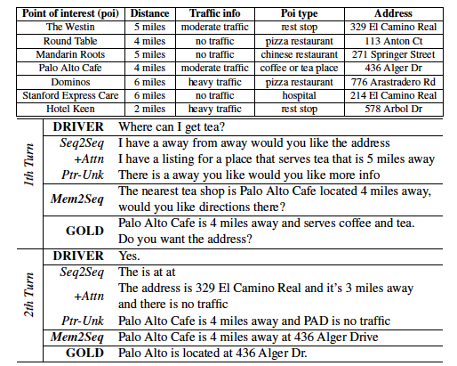

表1：In-Car Assistant在导航领域的生成回复实例

表6：In-Car Assistant数据集在行程安排领域上生成的回复实例

**Examples**:表1和表6显示了来自车载助手数据集的两个测试集样本中不同模型的生成响应。 我们报告此数据集中的示例，因为它们的答案更像人类，而不像其他的那样具有结构性和重复性。 Seq2Seq一般不能产生相关信息，有时会在语言建模中失败。 相反，使用注意力有助于解决这个问题，但它仍然很少产生正确的实体。 例如，Seq2Seq在表1中产生了5英里的注意力，但正确的是4英里。 此外，Ptr-Unk通常无法从输入中复制正确的token，如表1中的“PAD”所示。另一方面，Mem2Seq能够在这两个示例中产生正确的响应。 特别是在导航域中，如表1所示，Mem2Seq产生不同但仍然正确的话语。 我们在补充材料中报告了所有领域的更多示例。

**Discussion**传统的面向任务的对话系统（Williams和Young，2007）仍然广泛用于商业系统，需要在系统设计和数据收集方面进行大量的人力工作。另一方面，尽管端到端对话系统还不完善，但它们需要更少的人为干预，特别是在数据集构建中，因为原始会话文本和KB信息可以直接使用而无需大量预处理（例如NER，依赖解析）。在这种程度上，Mem2Seq是一个简单的生成模型，能够将KB信息与有前途的泛化能力结合起来。我们还发现实体F1得分可能是比每回应准确度或BLEU得分更全面的评估指标，因为人们通常可以选择正确的实体但具有非常多样化的响应。实际上，我们希望强调人类可能具有较低的BLEU分数，尽管它们的正确性，因为在给定的响应和预期的响应之间可能没有大的n-gram重叠。然而，这并不意味着BLEU评分与人类评估之间没有相关性。事实上，与聊天机器人和开放域名对话不同，BLEU得分与人类评估无关（Liu et al。，2016），在面向任务的对话中，答案仅限于特定实体和循环模式。因此，我们认为BLEU评分仍然可以被视为一项相关措施。在未来的工作中，可以应用几种方法（例如，强化学习（Ranzato等，2016），Beam Search（Wiseman和Rush，2016））以改善响应相关性和实体F1得分。但是，我们希望尽可能简化模型，以便即使没有高级培训方法也能很好地运行。

## 九.相关工作

- 用于访问存储器的Mem2Seq查询生成阶段可以被视为存储器增强神经网络（MANN）中使用的存储器控制器。 类似地，存储器编码器已经用于神经机器翻译（Wang等人，2016）和元学习应用（Kaiser等人，2017）。
-  然而，Mem2Seq与这些模型的不同之处在于：它结合复制机制使用多跳注意，而其他模型使用单个矩阵表示。 2）仅依赖于自我注意机制的非复发生成模型（Vaswani等，2017）与MemNN中使用的多跳注意机制有关。

## 十.结论

在这项工作中，我们为面向任务的对话系统提供了端到端的可训练的Memory-to-Sequence模型。 Mem2Seq将端到端存储器网络中的多跳注意机制与指针网络的概念相结合，以结合外部信息。 我们凭经验显示我们的模型使用外部KB信息和预定义词汇表生成相关答案的能力，并可视化多跳注意机制如何帮助学习记忆之间的相关性。 Mem2Seq快速，通用，能够在三个不同的数据集中实现最先进的结果。

